<p align="center">
  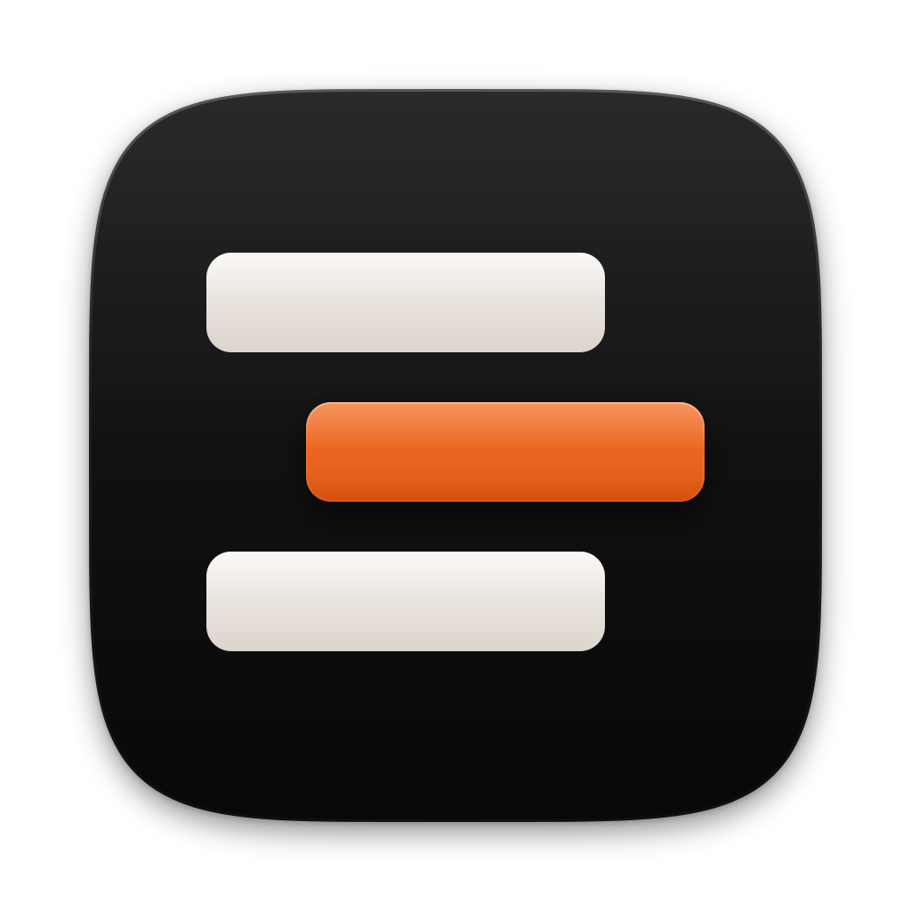
</p>

<h1 align="center">Agentbox</h1>

<p align="center">
  <strong>Give your agents an inbox.</strong><br>
  Run twenty coding agents at once and only hear from the ones that need you.
</p>

<p align="center">
  <a href="#get-it">Get it</a> ·
  <a href="#how-it-works">How it works</a> ·
  <a href="#what-matters-most-goes-first">Priorities</a> ·
  <a href="#built-for-the-keyboard">Keys</a> ·
  <a href="#what-this-sends">Privacy</a> ·
  <a href="LICENSE">GPL-3.0</a>
</p>

<p align="center">
  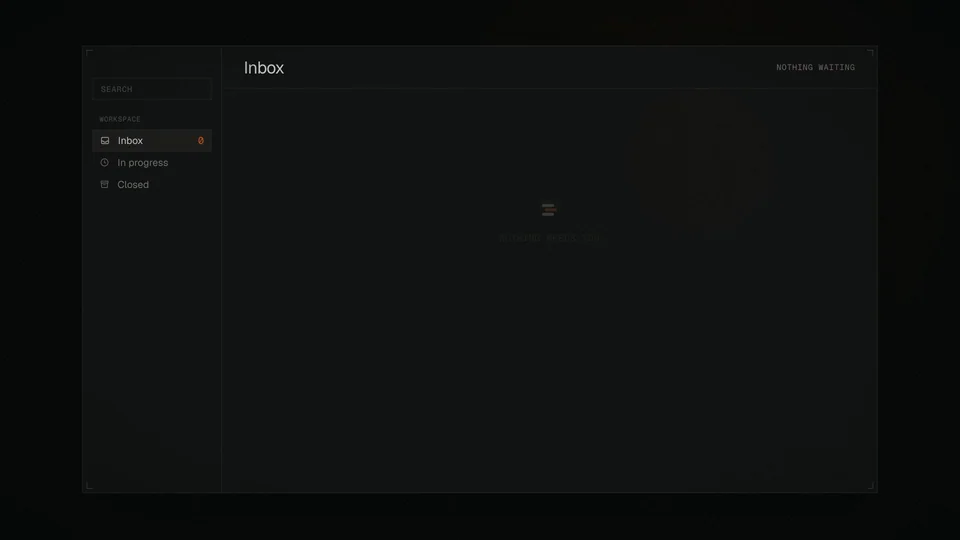
</p>

<p align="center">
  Free and open source. Runs in your browser or as a Mac app, on the Claude Code or Codex plan you already have.<br>
  No server, no account, no extra subscription.
</p>

---

## The chat window is the bottleneck

Today you run agents in chat windows and terminals, and you wait for each one
to finish before you prompt it again. So the number of agents you can run is
the number of windows you can keep track of, which is about four.

<p align="center">
  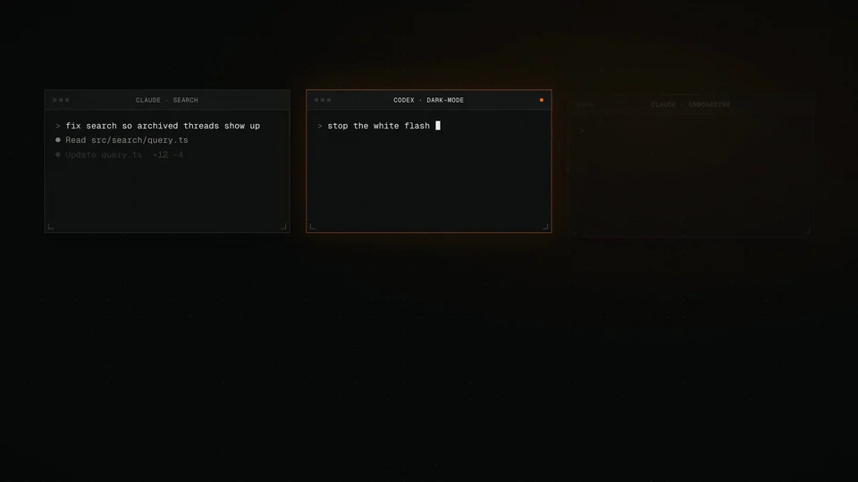
</p>

Models are now good enough that most tasks do not need watching. They need
someone to review the work at the right moment. Agentbox drops the chat window
and gives each agent a row in an inbox instead, so you can run far more of them
than you could ever watch and only deal with one when it actually needs you.

## Get it

Two ways to run it. Both need Node 22 and Claude Code installed and signed in.
Codex is optional and is picked up when it is there.

**In your browser.** One command, nothing to install first:

```
npx agentbox-app
```

It starts on your machine and opens a tab. Nothing is hosted: it listens only
on your own computer, and the address carries a key that is new every run. Add
`--help` to see the options.

**As a Mac app.** Build it from this repo:

```
git clone https://github.com/savannahfeder/agentbox.git
cd agentbox
npm install
npm start
```

`npm start` builds the app and opens it. On first run it walks you through
connecting Claude Code and choosing a folder to work in.

## How it works

### 1. File the work

Paste a list, send over a board of issues, or type one task. Each item becomes
its own row, and each row is its own agent, already working.

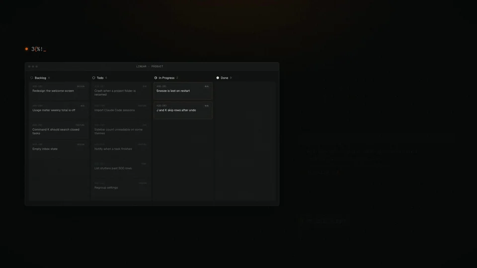

### 2. Walk away

Nothing needs you while they run. Go to lunch. A row only comes back to you
when its agent is done or stuck, so a hundred agents working is as quiet as one.


### 3. Come back to an inbox

Every row opens with what the agent did and what it wants from you, in two
lines you can read at a glance. Most of the time the answer is yes. Press `1`
and it merges, and the next one is already in front of you.

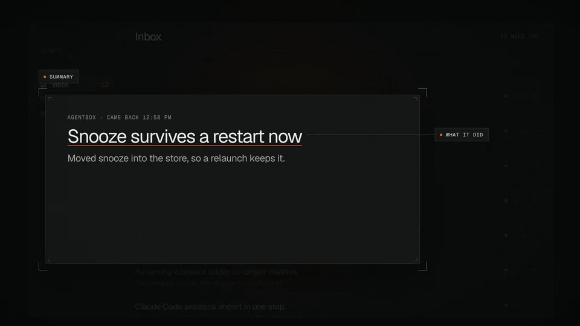

### 4. Answer however fits

<table>
  <tr>
    <td width="50%" valign="top">
      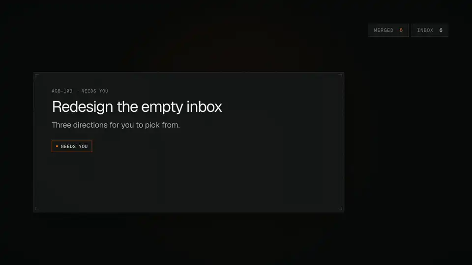<br>
      <strong>Pick a design.</strong> Ask for options before anything is built,
      and agents come back with versions drawn in your actual app. Pick one and
      that one gets built.
    </td>
    <td width="50%" valign="top">
      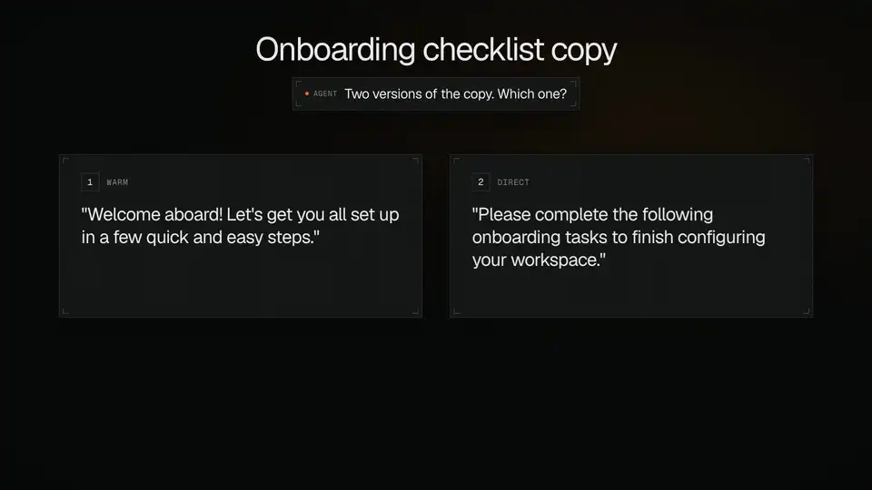<br>
      <strong>Send it back.</strong> When none of the options is right, type a
      sentence. The agent picks up where it left off, and the row comes back
      to you when it is done.
    </td>
  </tr>
</table>

### 5. Stay the person in the loop

Your job stops being watching agents work. It becomes reviewing what they made
and deciding whether it is good enough. This agent got a failing test to pass by
editing the test instead of the code, which is exactly the moment you want to be
asked. Code changes open right beside the row.

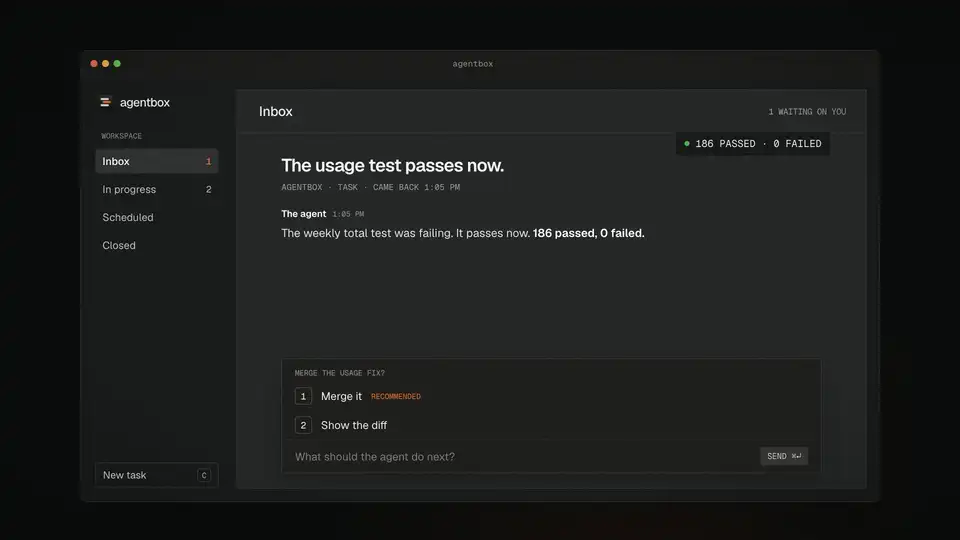

## What matters most goes first

Twenty agents means twenty things competing for your attention and for a limited
number of running sessions. Agentbox keeps one order and uses it for both.

- **Tag a task** Urgent, High, Medium or Low, when you file it or later from `⌘K`.
- **Rank your projects** once by dragging them into order. A project's place
  counts for more than any single task's tag, so your most important project
  never waits behind a side one.
- **The order decides who starts.** When there are more tasks than session
  slots, the queue starts the most important first. An answer you have already
  given wins a tie against new work, so replies never pile up.
- **Urgent rises to the top.** Urgent rows sit above everything else in the
  inbox under their own heading.
- **Only your tags count.** An agent cannot promote its own work. If it says
  its task is urgent, that is ignored.

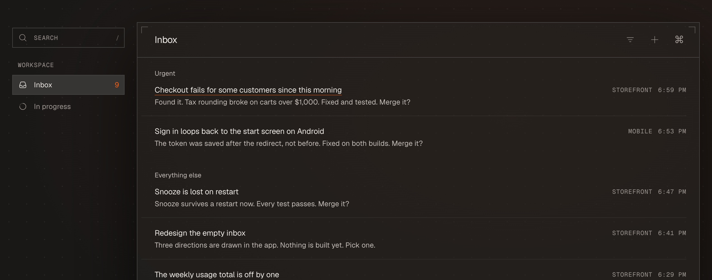

<p align="center">
  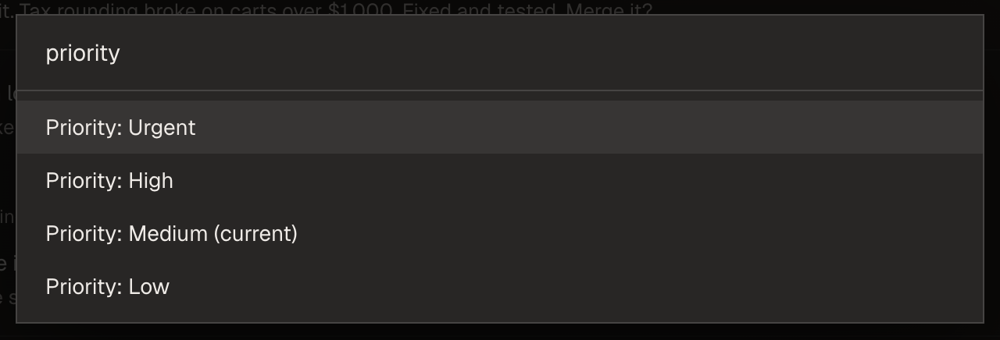<br>
  <sub>Any row's priority is a <code>⌘K</code> away.</sub>
</p>

## Built for the keyboard

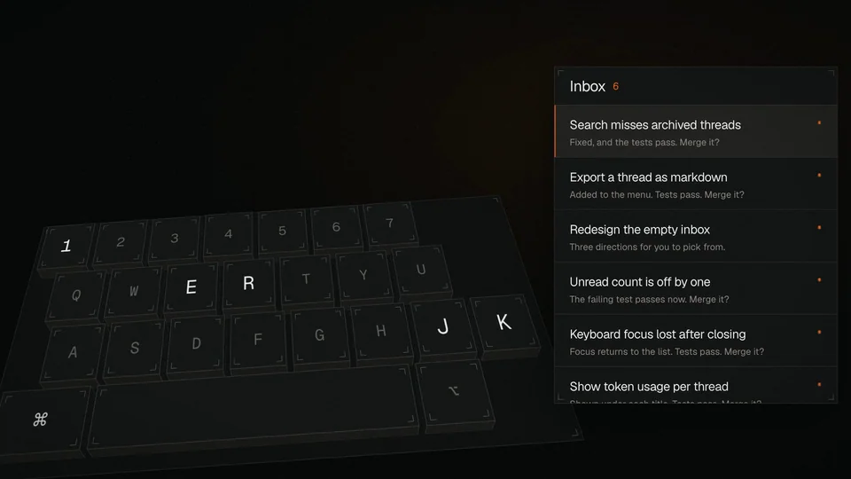

| Key | Does |
|---|---|
| `J` `K` or arrows | Move through the inbox |
| `Enter` | Open a row |
| `E` | Approve the recommendation, or mark a row done |
| `1` `2` `3` | Pick an option an agent offered |
| `R` | Reply |
| `C` | New task |
| `S` | Snooze |
| `Z` | Undo |
| `⌘K` | Everything else |

Fifteen skins, each in light and dark, from plain slate to woodblock and riso
prints. Press `⌘K` and type "theme".

## Runs on the plan you already have

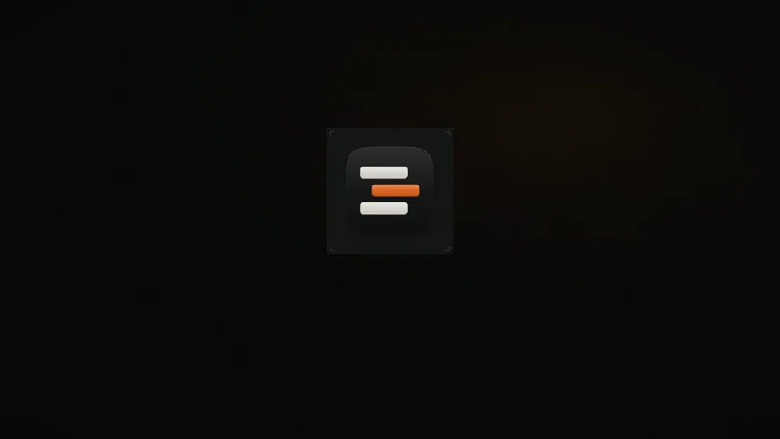

Agentbox drives Claude Code and Codex on your own machine, signed in with your
own subscription. When you first open it, it finds the agents you have already
set up and offers to bring them in. There is no server, no account to make, and
nothing new to pay for.

---

## Reference

<details>
<summary><strong>Config</strong></summary>

<br>

`zero.config.json` in the repo root, gitignored and machine-specific. Every
default works unset and they all live in `main/config.mjs`. The ones that
matter:

- `storeRoot`: where the store lives. Defaults to a folder named after the app
  in your home directory.
- `claudeBin`: the binary to run. The app finds `claude` itself if you leave
  this alone.
- `maxConcurrentSessions`: how many agents run at once. The queue absorbs the
  rest, in priority order.
- `sessionArgs`: what a spawned session may do. **The default grants only the
  store tools**, so an agent can read the store, file questions and update work
  items, and nothing else. To let agents edit code and run commands, opt in:

  ```json
  { "sessionArgs": ["--allowedTools", "mcp__agentbox", "--permission-mode", "acceptEdits"] }
  ```

  That grant is yours to make deliberately. The app never escalates it for you.

- `personalProducts`: workspaces that are your own tasks rather than a product,
  for example `["personal"]`. Sessions there get your message and nothing else,
  and replying resumes the same session, like a thread.
- `diagnostics`: `false` turns off the counts described below.

</details>

<details id="what-this-sends">
<summary><strong>What this sends</strong></summary>

<br>

Nothing, unless you are running a build that was signed and released with a
PostHog key baked into it. A build made from this repo has no key, so a clone
and a fork are silent, and with no key the whole path is off at every send.

A released build counts seven things, and they are counts:

- the app was opened
- first run finished
- a repo was connected
- an agent was seen
- a task was opened
- a reply was sent
- a task finished

Each carries a random install id, the app and platform version, and at most
four other things: how long something took, how many of a thing there were,
which kind of row it was out of six fixed words, and whether an agent or you
did it. No file contents, no prompts, no paths, no titles, nothing you typed.
`shared/analytics-events.mjs` is the whole list, and anything a caller attaches
beyond those four is dropped rather than sent, so nobody can widen it by
accident. Crash reports travel the same way and are scrubbed first
(`shared/crash-scrub.mjs`).

**The events can be turned off,** and either way is enough on its own:

- In the app: Settings, then the "Counts and crash reports" switch.
- In `zero.config.json`: `"diagnostics": false`.

The update check is separate and is not routed through any of this. It is a
request to github.com for the latest release, it carries no identity and no
key, and it only happens in a packaged build.

The thing that sends the most is not ours at all. This app drives Claude Code
and Codex, so whatever a session reads and writes goes to Anthropic or OpenAI
under their terms, exactly as it would if you ran those tools yourself.

</details>

<details>
<summary><strong>How it is built</strong></summary>

<br>

Sessions are cattle and the store is the truth. The durable state is a folder
on disk at `storeRoot`, written through `main/store/` so the fold rules exist
in exactly one place. The app can crash, restart or be rewritten without any
agent noticing.

- `main/` the Electron main process: config, the store
  (`main/store/work-items.mjs` is the single write path), the supervisor that
  spawns one headless session per work item, and IPC.
- `mcp/` the store server handed to those sessions.
- `renderer/` the inbox: list, focus mode, rail, compose, palette, browser.
- `briefs/` the judgment: worker and dispatcher prompts. Edit these rather than
  the code to change how agents behave.
- `tests/` the suite, which is large and is the documentation of record for how
  any of this is meant to behave.

</details>

<details>
<summary><strong>Develop</strong></summary>

<br>

```
npm run dev        # vite HMR plus electron
npm test
```

Useful modes:

- `ZERO_FIXTURES=1` canned data, with no store and no agents touched
- `ZERO_FIXTURES=empty` inbox zero
- `ZERO_NO_SUPERVISOR=1` never spawn sessions
- `ZERO_SCREENSHOT=/tmp/x.png` capture the window and quit

The same fixture worlds are reachable off the url, which is how the
`scripts/shot-*.mjs` family photographs them: `?fixtures`, `?fixtures=empty`,
`?fixtures=crowded`, `?fixtures=mock`, `?working=3`. `?engines=`
picks which coding agents the fixture Mac has, where nothing is one agent,
`?engines=missing` is the gate open with Codex not found, and `?engines=claude`
or `?engines=codex` give two.

To open the app as somebody who has never seen it, with its own throwaway home
and nothing of yours inside it, press `⌘K` and choose "Open agentbox as a new
user". `npm run fresh` does the same from a terminal.

The app is named in exactly one place, `shared/product-name.mjs`. Change it
there and run `node scripts/product-name.mjs --write`, and everything else
follows. The `zero` and `ZERO_` prefixes through the code are the name it had
first and are load-bearing in places, so they are left alone.

The pictures in this README live in `docs/readme/`. The two stills are taken of
the real app by `scripts/shot-readme.mjs`; the moving ones are cut from the
launch film.

</details>

## Licence

GPL-3.0-or-later. See [LICENSE](LICENSE).
